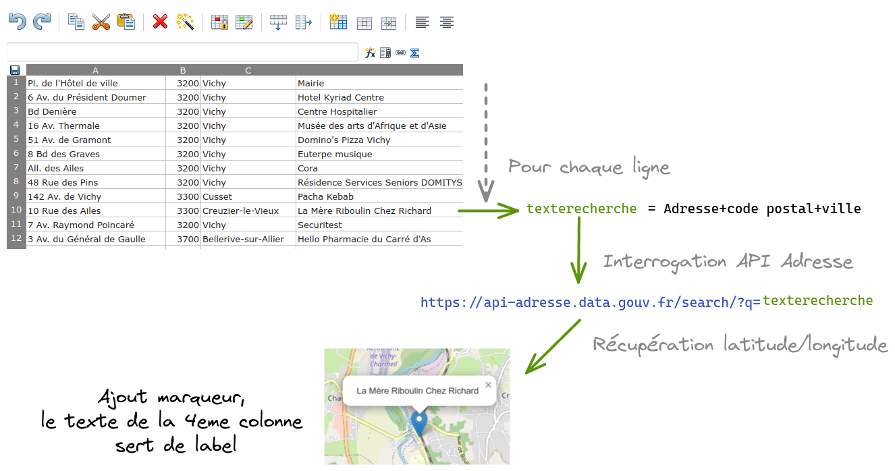

# table2map

Page de test pour afficher des adresses stoquées sous forme de table sur une carte sans soliciter les GAFAM

Pour les géolocalisations on utilise [leaflet](https://leafletjs.com/) qui s'appuie sur des fonds de carte [OpenStreetMap](https://www.openstreetmap.org)

Pour afficher un marqueur sur la carte il nous faut des coordonnées, latitude et longitude.

Il faut donc traduire chaque adresse postale en coordonnées. Pour cela on ne souhaite pas utiliser Google ou autre Bing.

Il existe une **API Adresse** sur https://adresse.data.gouv.fr qui semble fonctionner : https://adresse.data.gouv.fr/api-doc/adresse

L'idée est de parcourir la table des adresses et pour chaque ligne, faire une requête à cette **API Adresse** afin de récupérer les coordonnées.

Une fois les coordonnées récupérées, on crée un marqueur sur la carte avec ***leaflet***

Dans cet exemple, les adresses sont stockées dans un tableur Ethercal chez Framasoft, service [Framacalc](https://framacalc)

Il y a 4 colonnes :
- adresse (n° + rue)
- code postal
- ville
- label

Pour chaque ligne on utilise adresse+code postal+ville, la 4eme colonne sert juste pour le label et ne transite pas sur le réseau pour l'API Adresse.

Je lis les data directement depuis le classeur framacalc, il y a aussi une fonction pout lire un fichier CSV local. A voir.